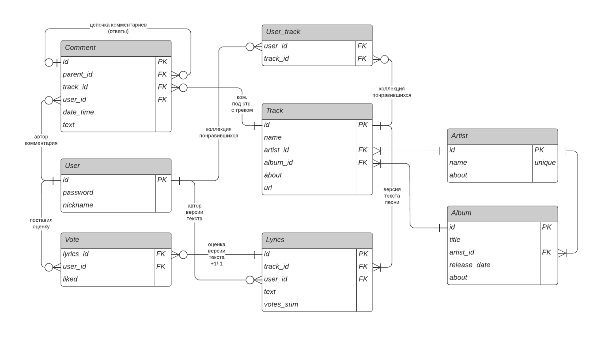

# Colyrics
Учебный проект реляционной базы данных для вебсайта, позволяющий просматривать, добавлять и редактировать тексты песен.
> colyrics - упрощенная гипотетическая система для задания контекста и требований, сам вебсайт не существует и не разрабатывается.
## Требования к системе
**Посетители сайта могут:**
 - искать тексты песен по названию трека, строчке из текста, исполнителю, альбому;
 -  просматривать тексты песен;
 -  просматривать комментарии к текстам песен;
 -  просматривать дополнительную информацию по исполнителю, альбому, треку (если таковая имеется).
 
 **Зарегистрированные пользователи (далее – пользователи) помимо вышеуказанного могут:**
 - добавлять новые тексты песен или новые версии существующих текстов;
 - оценивать версии текстов, добавленные другими пользователями, посредством выбора опции +1 или -1 (выбор можно менять, но несколько раз выставить один тип оценки невозможно);
 -  оставлять комментарии под песней (например, с объяснением смысла текста или интересными фактами);
 - отвечать на существующий комментарий;
 - добавлять треки в коллекцию любимых в своем профиле;
 - вносить и редактировать дополнительную информацию о треках, исполнителях, альбомах (поля about, ссылку на youtube клип).

**Регистрация и авторизация:**
- Регистрация пользователя по уникальному строковому id и строковому паролю, указание желаемого никнейма для отображения на сайте (не обязательно уникального)
- Вход в ранее созданную учетную запись по id и паролю 

**Добавление текстов:**
- Если трек уже есть на сайте: добавление новой версии текста (Lyrics)
- Если трек / исполнитель / альбом не существует: заполняется соответствующая информация (поля будут указаны далее в ER) об исполнителе / альбоме / треке и добавляется текст песни. Для пользователя это будет выглядеть как единая форма для заполнения, чтобы альбомы и артистов можно было добавлять только непосредственно при добавлении трека. Однако, на уровне sql запросов сущности исполнителей и альбомов создаются отдельно.

## Ограничения на данные
- У трека ровно один автор-исполнитель (если это совместный трек нескольких исполнителей, эта информация указывается в описании), у исполнителя 1 или много треков
- Трек относится к 1 альбому (сингл – тоже альбом), в альбоме 1 или много треков
- Альбом принадлежит ровно 1 исполнителю, у исполнителя может быть 1 или много альбомов – У пользователя ровно 1 коллекция любимых треков, коллекция относится к 1 пользователю
- В коллекции пользователя может быть 0 или много треков, трек могут добавить в коллекцию 0 или много пользователей
- Пользователь может оценить 0 или много текстов, но конкретный текст только 1 раз, один текст могут оценить много пользователей
- Оценка принадлежит 1 пользователю и 1 тексту
- Пользователь может оставить 0 или много комментариев под 0 или многими треками (не конкретными текстами)
- Комментарий принадлежит 1 пользователю и 1 одному треку
- Комментарий может иметь 0 или много ответов (подкомментариев) и 0 или 1 родителя (если этот комментарий является ответом на другой)

## ER-диаграмма нормализованной схемы



> **Пример проблемы при отсутствии нормализации:** мы могли бы не использовать таблицу `Artist`, а вместо этого добавить аттрибут `artist` у `Track`. В таком случае мы получим update-аномалию, ведь нам придется просматривать всю таблицу `Track`, чтобы изменить имя конкретного исполнителя.
## Функциональные зависимости
### Track
 *{[id, name, artist_id, album_id, about, url]}*
- *{id} —> {name, artist_id, album_id, about, url}*
- *{name, artist_id, album_id} —> {id, about, url}*
### Artist
*{[id, name, about]}*
- *{id}  —> {name, about}*
- *{name}  —> {id, about}*
### Album
*{[id, title, artist_id, release_date, about]}*
- *{id}  —> {title, artist_id, release_date, about}*
- *{title, artist_id}  —> {id, release_date, about}*
> в приведенных выше 3-х таблицах можно было обойтись без *id*, т.к. существуют другие *candidate key*, но т.к. другие таблицы часто ссылаются на эти данные, удобнее использовать *id* в качестве *foreign key*.
### User
*{[id, password, nickname]}*
- *{id}  —> {password, nickname}*
### Lyrics
*{[id, track_id, user_id, text, votes_sum]}*
- *{id}  —> {track_id, user_id, text, votes_sum}*
### Comment
*{[id, parent_id, track_id, user_id, date_time, text]}*
- *{id}  —> {parent_id, track_id, user_id, date_time, text}*
	> теоретически, *{track_id, user_id, date_time}* можно тоже считать *superkey*, но на практике можно добиться практически одновременного (относительно значения timestamp) оставления комментариев одним пользователем (напр., ботом), тогда комментарий уже нельзя однозначно идентифицировать по этой связке
### Vote
*{[lyrics_id, user_id, liked]}*
- *{lyrics_id, user_id}  —> {liked}*
### User_Track
*{[user_id, track_id]}* - no FD

## Скрипты: SQL DDL
```sql
create table if not exists "user" ( 
	id varchar primary key,
	password varchar not null,
	nickname varchar not null
);
```
```sql
create table if not exists "artist" (
	id serial primary key,
	name varchar unique not null,
	about varchar
);
```
```sql
create table if not exists "album" (
	id serial primary key,
	title varchar not null,
	artist_id int not null references "artist" (id) on delete cascade,
	release_date date,
	about varchar
);
```
```sql
create table if not exists "track" (
	id serial primary key,
	name varchar not null,
	artist_id int not null references "artist" (id) on delete cascade,
	album_id int not null references "album" (id) on delete cascade,
	about varchar,
	url varchar 
);
```
```sql
create table if not exists "user_track" (
	user_id varchar not null references "user" (id) on delete cascade,
	track_id int not null references "track" (id) on delete cascade
);
```
```sql
create table if not exists "lyrics" (
	id serial primary key,
	track_id int not null references "track" (id) on delete cascade,
	user_id varchar not null references "user" (id) on delete cascade,
	text varchar not null,
	votes_sum int not null default 0 
);
```
```sql
create table if not exists "vote" (
	user_id varchar not null references "user" (id) on delete cascade,
	lyric_id int not null references "lyrics" (id) on delete cascade,
	liked bool not null 
);
```
```sql
create table if not exists "comment" (
	id serial primary key,
	parent_id int default null references "comment" (id) on delete cascade,
	track_id int not null references "track" (id) on delete cascade,
	user_id varchar not null references "user" (id) on delete cascade,
	date_time timestamp not null,
	text varchar not null
);
```
## Запросы: SQL DML
**Добавление артиста**
```sql
insert into "artist" (name) values ('Rick Astley');
```
**Добавление альбома**
```sql
insert into "album" (title, artist_id, release_date)
values ('Whenever You Need Somebody',
		(select id from artist where name='Rick Astley'),
		'1987-11-16');
```
**Добавление трека**
```sql
insert into "track" (name, artist_id, album_id, about, url)
values ('Never Gonna Give You Up',
		(select id from artist where name='Rick Astley'),
		(select id from album where title='Whenever You Need Somebody'),
		null,
		'https://www.youtube.com/watch?v=dQw4w9WgXcQ');
```
Далее будут представлены более интересные и сложные, на мой взгляд, запросы, а рутинные  будут опущены.

**Выставление оценки текста и обновление рейтинга у `lyrics`**
```sql
create or replace procedure rate_lyrics(lyric_id int, user_id varchar, liked bool)
language sql
as $$
	insert into vote (user_id, lyric_id, liked) values (user_id, lyric_id, liked);
	update lyrics set votes_sum = votes_sum + ((liked::int) - ((not(liked))::int))
$$;
```
**Поиск треков по названию**
```sql
select t.id, t.name, ar.id, ar.name, al.id, al.title, t.about, t.url, l.text
from track as t
inner join artist ar on ar.id = t.artist_id
inner join album al on al.id = t.album_id
inner join lyrics l on t.id = l.track_id
where lower(t.name) like '%give%up%';
```
**Поиск треков по исполнителю**
```sql
select t.id, t.name, ar.id, ar.name, al.id, al.title, t.about, t.url, l.text
from track as t
inner join artist ar on ar.id = t.artist_id
inner join album al on al.id = t.album_id
inner join lyrics l on t.id = l.track_id
where ar.name = 'Rick Astley';
```
**Получение прямых ответов на заданный комментарий**
```sql
select c.*
from comment c
inner join comment c2 on c.parent_id = c2.id
where c.parent_id = ?;
```
**Получение цепочки ответов, включая вложенные, на данный комментарий (обход графа в ширину):**
```sql
with recursive chain_under_comment(id, user_id, track_id, date_time, text, level)
	as (values (1,
		 (select user_id from comment where id = 1),
		 (select track_id from comment where id = 1),
		 (select date_time from comment where id = 1),
		 (select text from comment where id = 1), 0)
	union all
	select c1.id, c1.user_id, c1.track_id, c1.date_time, c1.text, level + 1
	from comment c1
	join chain_under_comment c2 on c1.parent_id = c2.id)
select * from chain_under_comment;
```
(`level` - уровень вложенности)

**Получение коллекции любимых треков пользователя**
```sql
select t.id, t.name, a.id, a.name, a2.id, a2.title, t.about, t.url, l.text
from user_track ut
inner join track t on ut.track_id = t.id
inner join artist a on t.artist_id = a.id
inner join album a2 on a2.id = t.album_id
inner join lyrics l on t.id = l.track_id
where ut.user_id = ?;
```
